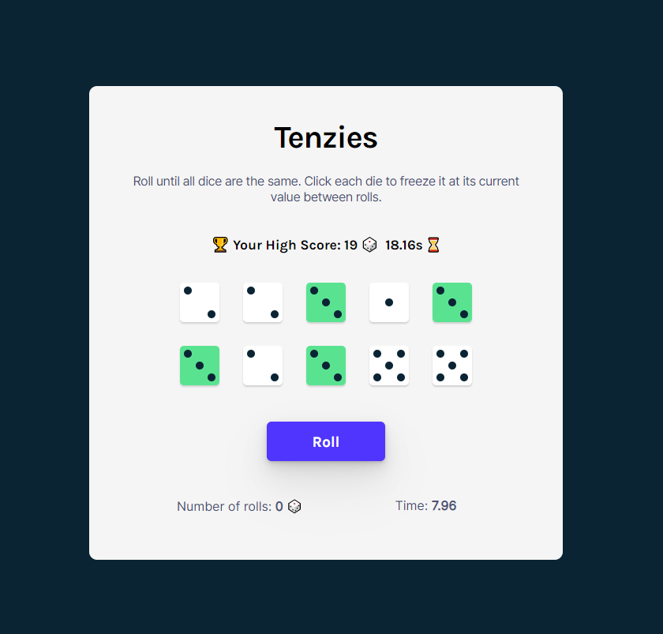
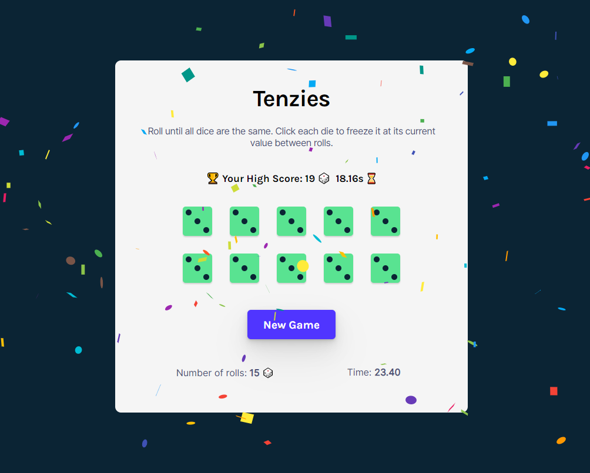

# Tenzies

## Overview

Tenzies game. Roll the dice untill all dice are the same. Clicking each die can freeze it at it current value and prevent from further roll.
React course by Bob Ziroll.

Figma design:
https://www.figma.com/file/FqsxRUhAaXM4ezddQK0CdR/Tenzies?node-id=0%3A1

Added additional assignment features: 
🚀 Your High Score is saved in LocalStorage.  
🚀 CSS: dots instead of numbers on dice  
🚀 Number of rolls tracked  
🚀 Time it took to win tracked  

### Screenshots

<table>
        <tr>
		    <td>
                
            </td>
			<td>
                 
            </td>
        </tr>
</table>

Site available on gh-pages : https://alicja1bobko.github.io/Tenzies/